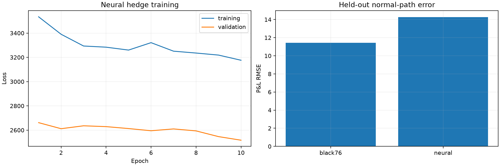
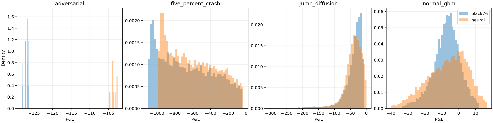
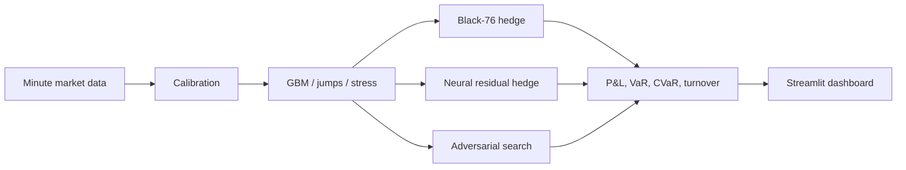

# Delta Hedging & Adversarial Stock Path Simulator

How often should an option be delta-hedged? Hedging more frequently reduces the
gap between rebalances, but every trade costs money. This project turns that
trade-off into a reproducible experiment using minute-level NIFTY futures and
options data.

The simulator calibrates market dynamics from the supplied futures series,
generates thousands of possible price paths, and hedges a European option along
each path. It then measures the full terminal P&L distribution—not just the
average result—using RMSE, VaR, CVaR, downside deviation, turnover, and trading
costs.

## What works today

- Loads and validates minute-level NIFTY futures, calls, and puts
- Parses instrument type, strike, option side, and encoded expiry from symbols
- Prices options on futures with Black-76 and calculates delta and implied vol
- Calibrates drift, volatility, and empirical jump behavior from observed data
- Generates reproducible GBM and Merton jump-diffusion paths
- Supports high-volatility, repeated-jump, and forced-crash stress scenarios
- Runs discrete delta hedges at anywhere from 1 to 375 intraday hedge times
- Accounts for option premium, cash interest, futures variation margin,
  transaction costs, terminal payoff, and final hedge closure
- Simulates 10,000 paths at a time and produces comparison tables and charts
- Trains a residual neural hedge through terminal P&L and transaction costs
- Compares Black-76 and neural hedging on unseen normal, jump, crash, and
  adversarial paths
- Provides an interactive Streamlit dashboard for exploring scenarios

The project includes constrained adversarial path search. Rather than
calling a tiny-data neural model a reliable generator, it evolves smooth return
control points toward paths that maximize hedge loss, turnover, or transaction
cost while enforcing explicit volatility and movement limits.

## A result worth noticing

On 10,000 calibrated GBM paths, zero-cost hedging improved steadily as the hedge
became more frequent. Once a one-basis-point trading cost was introduced, the
relationship changed:

| Intraday hedge times | No-cost P&L RMSE | 1 bp cost P&L RMSE |
|---:|---:|---:|
| 5 | 20.91 | 21.64 |
| 15 | 11.68 | 13.38 |
| 30 | 8.30 | 11.52 |
| 60 | 5.89 | **11.31** |
| 100 | 4.51 | 12.39 |
| 375 | **2.36** | 19.66 |

Without costs, hedging every minute produced the smallest error. With costs,
roughly 60 hedge times performed best in this experiment; beyond that point,
the extra turnover outweighed the reduction in discretization error. This is a
simulation result under the stated assumptions, not a trading recommendation.

## Neural hedge: where it helped and where it did not

The neural policy learns a bounded adjustment around Black-76 delta. It is
trained end to end on simulated GBM and jump-diffusion paths using terminal P&L,
downside loss, and trading costs. Evaluation uses unseen paths and identical
accounting for both strategies.

| Held-out scenario | Black-76 RMSE | Neural RMSE | Neural change |
|---|---:|---:|---:|
| Normal GBM | **11.42** | 14.27 | +25.0% |
| Jump diffusion | 70.93 | **66.39** | -6.4% |
| Forced 5% crash | 730.19 | **646.31** | -11.5% |
| Constrained adversarial | 127.18 | **103.89** | -18.3% |

The neural hedge was more robust under model misspecification and stress, but
plain Black-76 remained substantially better when its GBM assumptions were
correct. This is a useful negative result: the learned robustness is not free.





## Project layout



```text
src/
├── adversarial/    # Constrained evolutionary path search
├── analysis/       # Exploratory market-data reports
├── dashboard/      # Pure services used by the interactive app
├── data/           # Loading, symbol parsing, and validation
├── evaluation/     # P&L and tail-risk metrics
├── experiments/    # Reproducible benchmark entry points
├── hedging/        # Futures-based delta-hedging engine
├── models/         # Black-76 pricing and Greeks
├── neural/         # Neural policy, causal features, training, and inference
└── simulation/     # Calibration, GBM, jump diffusion, and stresses
tests/              # Pricing, data, simulation, accounting, and metric tests
data/               # Local CSV files (not committed)
outputs/            # Generated reports and charts (not committed)
```

## Getting started

Python 3.11 or newer is required. The examples below use PowerShell.

```powershell
git clone https://github.com/anirudh210705/delta-hedging-simulator.git
cd delta-hedging-simulator
python -m venv .venv
.\.venv\Scripts\Activate.ps1
python -m pip install -r requirements.txt
```

The raw market files are intentionally excluded from Git. Add compatible CSVs
to `data/`; the expected columns and units are documented in
[`data/README.md`](data/README.md).

Check the input data:

```powershell
python -m src.data.validation
```

Generate the exploratory market report:

```powershell
python -m src.analysis.exploratory
```

Run the complete 10,000-path simulation and hedging benchmark:

```powershell
python -m src.experiments.day2_benchmark
```

The benchmark writes calibrated parameters, metrics, sample paths, P&L
distributions, and the rebalancing comparison to `outputs/day2/`.

Run the stress and constrained adversarial benchmark:

```powershell
python -m src.experiments.day3_stress_benchmark
```

This compares normal GBM, volatility stress, crashes, rallies, and jump regimes
across six hedge frequencies. It also searches for paths targeting hedge loss,
turnover, transaction cost, and loss despite a near-flat terminal price. Results
and diagnostic charts are written to `outputs/day3/`.

Train and evaluate the neural hedge:

```powershell
python -m src.experiments.day4_neural_benchmark
```

The best validation checkpoint is written to `checkpoints/` and remains local.
Training history, held-out metrics, and P&L charts are written to `outputs/day4/`.

Launch the interactive dashboard:

```powershell
streamlit run app.py
```

The dashboard defaults to 1,000 paths and caches repeated simulations. It lets
you change the generator, volatility, jumps, forced shocks, strike, hedge
frequency, transaction costs, and seed, then inspect paths, hedge positions,
the P&L distribution, and tail-risk metrics.

## What “adversarial” means here

An adversarial path is not allowed to take any shape it wants. Candidate return
sequences are interpolated from 24 control points and constrained by maximum
minute return, annualized volatility, total excursion, and terminal displacement.
An evolutionary search keeps and mutates the candidates that are hardest for a
specified hedge schedule. This provides a reproducible stress-testing tool while
remaining honest about the limited amount of historical training data.

## Accounting convention

This project hedges options on futures, not options on a cash-funded stock
position. A futures contract has no initial purchase notional, so gains and
losses enter the hedge account through variation margin:

```text
futures hedge gain = previous futures position × futures price change
```

The engine separately tracks the option premium, interest on cash, hedge
changes, transaction costs, option payoff, and final hedge closure. Positive
`option_position` means long; negative means short. Risk calculations define
loss as negative P&L, so a positive VaR or CVaR number represents a loss.

## Tests

The test suite covers Black-76 identities, implied-volatility recovery, symbol
parsing, dataset validation, simulation reproducibility, forced crashes, hedge
accounting, transaction costs, risk metrics, causal neural features, finite
training, checkpoint restoration, and dashboard services.

```powershell
pytest --basetemp=.test-tmp
ruff check .
```

## Data limitation

The current dataset contains two complete trading sessions—750 futures minutes
in total. That is enough to demonstrate calibration, simulation, and hedge
accounting, but not enough to train a credible generative neural network. The
statistical estimates and benchmark results should therefore be treated as a
technical prototype rather than broad evidence about live-market performance.

There is also a naming inconsistency in the supplied data: the 5 February file
is labelled as an expiry session, while symbols such as
`NIFTY2621025750CE` appear to encode a 10 February 2026 expiry and still carry
substantial time value at the close. The code treats the filename as a label and
uses the expiry encoded in the instrument symbol.
